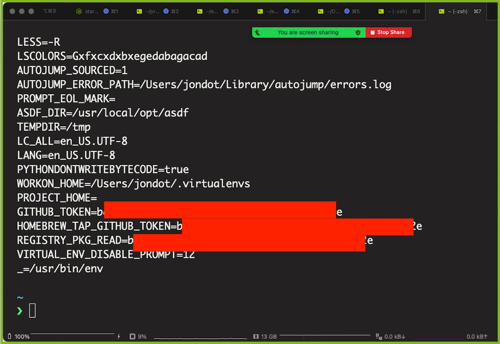

# senv - safer `env`


Friends don't let friends leak secrets in terminal windows.




:tv: Print your environment to the terminal without worry, even in recorded Zoom sessions  
:see_no_evil: Execute commands and block snooping your secrets  
:computer: Start an interactive shell with non-sensitive environment variables  
:whale: Use `senv` with Docker to ensure nothing inside the container is snooping around  
:hash: Copy `senv` to `/usr/bin` and use `/usr/bin/senv` in your shebang lines to ensure no secret leaks  


## Quick Start

You can install `senv` with homebrew:

```
$ brew tap spectralops/tap && brew install senv
````

### Print env

Use it just like `env`. Now you can print your environment in Zoom sessions :smile:

```
$ senv
```
### Execute command

Using `senv` before your command ensures no environment variable you don't want will be transferred to the binary that will run:


```
$ senv my-binary --myopts todo.txt
```

### A more secure shebang

Place `senv` in  `/usr/bin/senv`, and now you run safe, like so:

```sh
#!/usr/bin/senv node

console.log("hello, world")
```


## Options

```
$ senv --help
Arguments:
  [<cmd> ...]    Command to execute

Flags:
  -h, --help      Show context-sensitive help.
      --info      Show information
      --create    Create global config
      --config    Path to config file
```

## The redaction list

Redactions are simply names of sensitive keys, or regular expressions of keys. Any of these is good:


```
GITHUB_TOKEN
.*_TOKEN
```

You can can submit a pull request if this is a popular key, or add to your own global configuration if you like to do things in a different but specific way.

## Adding your own redactions

You can easily make your own custom redaction list. Create it:

```
$ senv --create
Wrote config to ~/.senv.yaml
```

Now you can add to your `.senv.yaml`:

```yaml
# ~/.senv.yaml

redact:
- MY_SECRET_TOKEN
```

`MY_SECRET_TOKEN` will now be removed from the environment, in addition to the set of redaction `senv` already performs. If you like to start from scratch and redact _only_ your own list:

```yaml
# ~/.senv.yaml

no_defaults: true
redact:
- MY_SECRET_TOKEN
```

## Use as a library

You can use `senv` as a library in the following way:

```go
import (
	"github.com/spectralops/senv/pkg"
)
senv := pkg.Senv{
  Cmd: []string{ "my-cmd", "arg1" }
}
senv.Init()
senv.Clean() // from this point your env is clean

// you can also use:
// senv.Print()
// senv.Exec()
```


## Contributing a default redaction

Default redactions are placed at [pkg/redact.go](pkg/redact.go). Please feel free to add a default and submit a PR if:

* It is well-known
* Generic enough, and not an edge-case

After adding a redaction, run & update tests if needed:


```
$ make test
```


### Thanks:

To all [Contributors](https://github.com/spectralops/senv/graphs/contributors) - you make this happen, thanks!

# Copyright

Copyright (c) 2021 [@jondot](http://twitter.com/jondot). See [LICENSE](LICENSE.txt) for further details.
